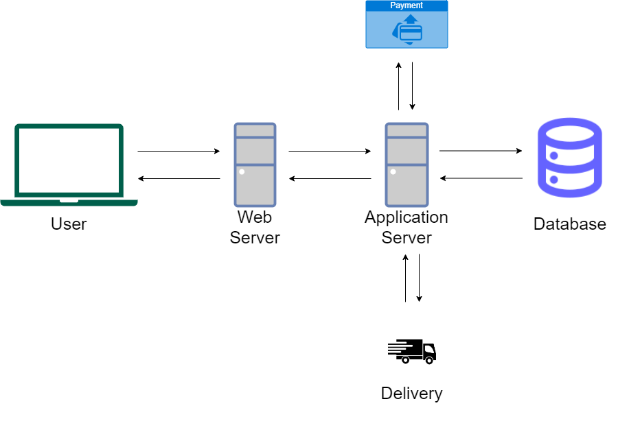
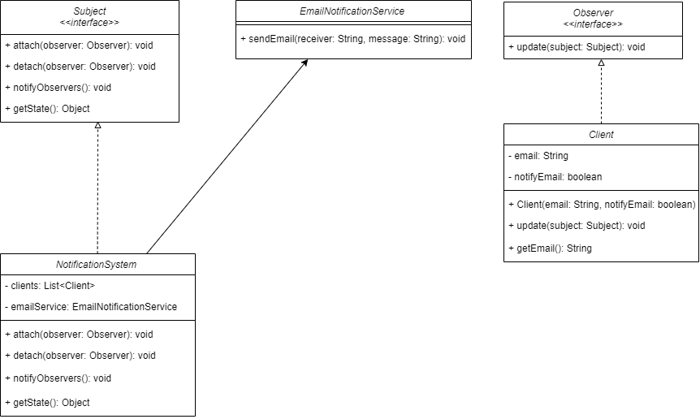
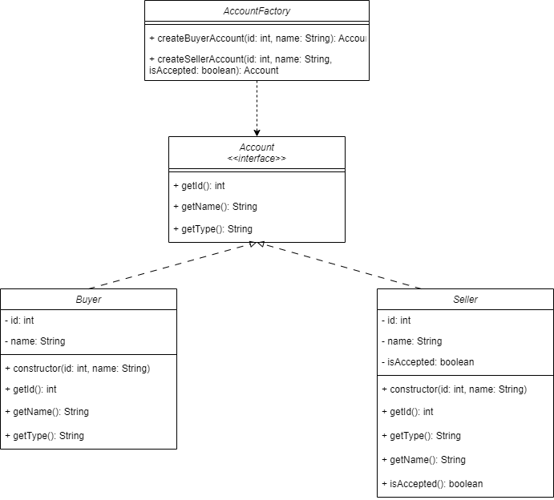

# E-commerce app - Osnaga Robert Viorel

## Introducere

In momentul actual, aplicatiile de e-commerce au devenit esentiale pentru afaceri cat si pentru consumatori. Aceste aplicatii sunt platforme online cu ajutorul carora vanzatorii isi pot pune in valoare produsele consumatorilor intr-un mod prin care pot fi vizualizate la un click distanta, de pe orice device.
Utilitatea aplicatiilor de e-commerce:
 - **accesibilitate** - aplicatie disponibila non-stop, cumparatorii pot vizualiza si cumpara produsele la orice ora.
 - **piata extinsa** - aceasta aplicatie nu are o acoperire, ea poate fi vizualizata de oriunde, deci produsele au o acoperire globala
 - **eficienta dpdv economic** - aplicatie de e-commerce este mai ieftin de intretinut decat un magazin fizic

Ne propunem sa dezvoltam o aplicatie de e-commerce prin care un vanzator isi poate expune produsele intr-un mod usor, prin care poate observa statistici asupra vanzarilor si produselor, iar cumparatorul sa aiba o interfata usor de folosit prin care isi poate gasi produsul dorit.

## Tehnologii folosite:

 - **front-end** - Angular
 - **back-end** - Java
 - **baza de date** - MySQL

## Functionalitatile aplicatiei

Atunci cand am intrat pentru prima data pe site, vom putea viziona produsele deja adaugate, fara a avea permisiunea de a cumpara sau a deveni un vanzator. Pentru aceste facilitati, trebuie sa ne cream un cont, astfel vor exista doua tipuri: un cont pentru un cumparator care poate fi creat imediat si un cont pentru vanzator care va dupa completarea campurilor obligatorii va trebui sa astepte un raspuns de accept sau refuz deoarece datele introduse trebuie verificate.

Astfel, vom avea 4 actori:

 - **vizitator** - actorul care poate doar sa vizioneze produsele
 - **cumparatorul** - actorul care poate viziona si cumpara produse
 - **vanzatorul** - actorul care listeaza produsele sale spre vanzare
 - **adminul** - actorul care gestioneaza problemele

Vizitatorul:

 - vizionarea produselor: Vizitatorul poate explora si vedea detalii despre diverse produse disponibile pe site.
 - cautarea anumitor produse: Utilizatorul poate folosi bara de cautare pentru a gasi produse specifice dupa nume.
 - alegerea unei liste de produse in functie de categorie: Vizitatorul poate naviga prin diferite categorii pentru a gasi produsele dorite.
 - aplicarea de filtre pe o anumita categorie: Utilizatorul poate filtra produsele pe categorii dupa criterii precum pret, brand, rating etc.
 - cererea ajutorului unui administrator: Vizitatorul poate solicita asistenta sau informatii suplimentare de la un administrator al site-ului.
 - crearea unui cont sau inregistrarea: Vizitatorul are optiunea de a-si crea un cont pentru a beneficia de functionalitati suplimentare.
 - vizualizarea recenziilor: Vizitatorul poate citi recenzii si evaluari ale altor utilizatori pentru a afla mai multe despre produsele de interes.
 - acces la oferte si promotii: Vizitatorii pot vedea ofertele si promotiile curente disponibile pe site.

Cumparatorul (pe langa functionalitatile vizitatorului):

 - adaugarea produselor in cos: Cumparatorul poate adauga produse in cosul de cumparaturi pentru achizitie ulterioara.
 - finalizarea comenzilor: Utilizatorul poate finaliza procesul de cumparare prin plasarea unei comenzi.
 - plata online: Cumparatorul poate efectua plata pentru produsele comandate folosind diverse metode de plata online.
 - urmarirea comenzilor: Utilizatorul poate verifica statusul livrarii pentru comenzile plasate.
 - vizualizarea istoricului comenzilor: Cumparatorul poate vedea o lista a tuturor comenzilor anterioare.
 - scrierea de recenzii: Utilizatorul poate scrie si publica recenzii pentru produsele achizitionate.
 - notificari pe email: Cumparatorul poate primi notificari si actualizari prin email despre comenzile sale si alte activitati relevante.
 - salvarea produselor in lista de dorinte: Vizitatorul poate salva produsele preferate intr-o lista de dorinte pentru a le revizui sau cumpara mai tarziu.

Vanzator:

 - gestionarea inventarului: Vanzatorul poate monitoriza si actualiza stocurile disponibile.
 - adaugarea unui produs: Vanzatorul poate adauga noi produse in platforma de eCommerce.
 - modificarea caracteristicilor unui produs: Vanzatorul poate edita detaliile si specificatiile produselor existente.
 - aplicarea de reduceri: Vanzatorul poate seta reduceri si promotii pentru anumite produse.
 - analiza vanzarilor: Vanzatorul poate accesa rapoarte si statistici despre performanta vanzarilor.
 - gestionarea comenzilor si livrarilor: Vanzatorul poate urmari si administra comenzile primite si procesele de livrare.
 - accesarea suportului tehnic: Vanzatorul poate solicita ajutor tehnic pentru problemele intampinate pe platforma.
 - gestionarea feedback-ului: Vanzatorul poate vedea si raspunde la recenziile si feedback-ul lasat de clienti.
Administrator:
 - rezolvarea problemelor semnalate de cumparatori, vanzatori si vizitatori: Administratorul gestioneaza si solutioneaza orice probleme raportate de utilizatorii site-ului.
 - verificarea cererilor de creare pentru conturile de cumparatori: Administratorul valideaza si aproba cererile de inregistrare ale noilor cumparatori.
 - monitorizarea performantei: Administratorul supravegheaza performantele site-ului si ale utilizatorilor sai.
 - adaugarea de functionalitati: Administratorul poate implementa noi functionalitati si imbunatatiri pe platforma.
 - gestionarea continutului site-ului: Administratorul poate edita si actualiza continutul paginilor de produs, paginilor informative si altor sectiuni ale site-ului.
 - securitatea site-ului: Administratorul se asigura ca site-ul este protejat impotriva amenintarilor de securitate si gestioneaza permisiunile utilizatorilor.

## User stories

### USER STORY #1 - Cautarea produselor

Ca **vizitator** sau **cumparator** 

**Vreau sa** caut un anumit produs dupa nume

**Pentru a** gasi produsul dorit.

**Criteriul de acceptare:**

**CA#1 - Gasirea produselor dorite**

In **bara de cautare** se tasteaza 

produsul dorit dupa care tasta **enter** 

iar produsele gasite sunt afisate.

**CA#2 - Produsul dorit nu exista**

In **bara de cautare** se tasteaza 

produsul dorit dupa care tasta **enter**

si se va afisa o pagina goala, cu un mesaj aferent.

### USER STORY #2 - Alegerea unei categorii de produse

Ca **vizitator** sau **cumparator** 

**Vreau sa** caut un anumit produs dupa categorie

**Pentru a** gasi produse din categoria dorita.

**Criteriul de acceptare:**

**CA#1 - Selectarea categoriei dorite**

In partea stanga a **paginii principale** exista o

**coloana** cu toate **categoriile** disponibile din care

**utiizatorul** isi poate alege.

### USER STORY #3 - Inregistrare ca cumparator

Ca **vizitator**

Vreau sa creez **un cont**

Pentru a **cumpara** produse

**Criteriul de acceptare:**

**CA#1 - Accesul paginii de inregistrare**

Ca **vizitator**

Accesez pagina de **conectare**

Si accesez butonul de **Register**

**CA#2 - Formular inregistrare**

Dupa pasul de la **AC#1**

Completez formularul de mai jos cu **datele** astfel:

|**Field Name** |**Field Type**         |**Mandatory/Optional**     |
|---------------|-----------------------|---------------------------|
|Nume           |Free text   Min 6 caractere   Max 20 de caracterte      |Mandatory                  |
|Prenume        |Free text   Min 6 caractere   Max 20 de caracterte      |Mandatory                  |
|email          |Free text   Min 6 caractere   Max 20 de caracterte      |Mandatory                  |  
|Parola         |Free text   Min 6 caractere   Max 20 de caracterte      |Mandatory                  |
|Repeta parola  |Free text   Min 6 caractere   Max 20 de caracterte      |Mandatory                  |

**Erori care pot sa apara**

**Eroarea 1 - Email-ul nu are formatul corect**

Forma **corecta** a unui **email** trebuie sa

fie de forma **firstname@example.com**

**Eroarea 2 - Nerespectarea valorilor minime sau maxima**

**Campurile completate** trebuie sa contina
**minim** 6 caractere si **maxim** 20 de caractere

**Eroarea 3 - Parola si Repeta parola contin parole diferite**

Cele **doua campuri** trebuie sa contina **aceeasi parola**

**Eroarea 4 - Email folosit**

**Email-ul** introdus este deja folosit deci

**exista** deja un cont cu acel email

### USER STORY #4 - Adaugarea produselor in cos

Ca **cumparator**

**doresc** sa adaug produsele dorite

**in cosul de cumparaturi**

**Criteriul de acceptare:**

**CA#1 - Adaugarea unui produs in cos**

**Cumparatorul** alege produsul, acceseaza

**pagina** lui si apasa pe butonul **Adauga in cos**

### USER STORY #5 - Scrierea unui review

Ca **cumparator**

**doresc** sa scriu o parere

despre un produs **cumparat**

**CA#1 - Scrierea de review**

**Cumparatorul** selecteaza pagina

**produsului** pe care l-a cumparat

**da un rating** produsului si suplimentar

**completeaza** o descriere

**Erori care pot sa apara**

**Eroarea 1 - Pagina produsului incorecta**

**Cumparatorul** poate accesa o pagina

a **altui produs** pe care nu l-a cumparat,

acesta neavand accesul la a scrie un **review**

### USER STORY #6 - Inregistrare ca vanzator

Ca **vizitator**

Vreau sa creez un **cont**

pentru a **vinde** produsele proprii

**Criteriul de acceptare:**

**CA#1 - Completarea datelor**

**Vizitatorul**, dupa ce a accesat

**pagina de inregistrare** de pe

**pagina principala**, completeaza

datele necesare, dupa care va primi

un mail cu acceptarea contului sau nu

### USER STORY #7 - Adaugarea produselor

**Vanzatorul** adauga unul

sau mai multe produse

**Criteriul de acceptare:**

**CA#1 - Adaugarea unui singur produs**

**Vanzatorul** adauga un singur produs

completand urmatoarele **date**:

|**Field Name** | **Field Type**    |
|---------------|-------------------|
|Nume produs    |Free text|
|Categorie Produs|Free text|
|Descriere|Free text|
|Specificatii|Free text|

**CA#2 - Adaugarea mai multor produse**

**Vanzatorul** poate sa adauge mai multe

produse, folosind un **fisier csv**

### USER STORY #8 - Aplicarea de reduceri

**Cumparatorul** vrea **sa adauge** unui

**produs** sau mai **multor produse**

**o reducere**

**Criteriul de acceptare**

**CA#1 - Selectarea produselor**

**Vanzatorul** intra pe pagina de reduceri,

**selecteaza** din lista sa de produse pe

cele care vor urma sa aiba o reducere si introduce

**procentajul**.

### USER STORY #9 - Aprobarea conturilor

Ca **administrator**

vrem sa acceptam unele cereri ale

**vanzatorilor** pentru a vinde

**Criteriul de acceptare**

**CA#1 - Verificarea conturilor**

**Administratorul** acceseaza pagina

de **conturi noi inregistrate**

si verifica **datele** introduse

de catre vanzatori.

**CA#2 - Acceptarea conturilor**

**Administratorul** dupa pasul de la

**CA#1** decide daca vanzatorul este eligibil

pentru a vinde pe site, in contrar il va refuza,

apasand pe butonul de **decline**

## Protocolul de comunicare

### Pentru conexiune client-server de vom folosi de **HTTPS**

### Pentru trimiterea de mail-uri ne vom folosi de **SMTP**

## Flow-ul mesajelor

### Vizitatorul acceseaza pagina web

Cerere de tip **GET** care returneaza pagina principala **e-commerce.html**

### Vizualizarea unui produs

**Vizitatorul** selecteaza un produs, se trimite o cerere

de tip **GET /product/{product_id}**, si **vizitatorul**

primeste pagina produsului.

### Log in

**Utilizatorul** introducele email-ul si parola, 

**browser-ul** trimite o cerere de tipul **POST /api/auth/login**,

cu urmatorul corp **{ "username": "user@example.com", "password": "password123" }**

### Adaugarea produsului in cos

**Cumparatorul** adauga produsul in cos,

**browser-ul** trimite o cerere de tipul

**POST /cart/add** cu **{ "productId": "{productID}", "quantity": 1 }**

### Finalizarea comenzii

**Cumparatorul** completeaza procesul de checkout,

**browser-ul** trimite o cerere de tipul

**POST /order/checkout** cu 

**{ "userId": "67890", "cart": [...], "paymentMethod": "creditCard", "shippingAddress": {...} }**

### Scrierea si trimiterea unei recenzii

**Vizitatorul** scrie o recenzie la un produs cumparat,

**browser-ul** trimite o cerere de tipul

**POST /review/submit** cu

**{ "productId": "12345", "userId": "67890", "rating": 5, "comment": "Recomand!" }**

### Adaugarea unui produs de catre vanzator

**Vanzatorul** intra pe pagina de adaugare produs,

completeaza **datele**, iar **browser-ul** trimite

o cerere de tipul **POST /api/addProduct** cu

**{"sellerId": "67890","productName": "Produs Nou","description": "Descriere detaliata a produsului","price": 100.0,"category": "Electronics","stock": 1500}**

### Aplicarea de reduceri

**Vanzatorul** intra pe pagina de reduceri, selecteaza

**produsele** pe care aplica o **reducere**, iar

**browser-ul** trimite o cerere de tipul

**POST /discount/apply** cu

**{"productIds": [1,2,3,4],"sellerId": "67890","discountPercentage": 20,"duration": 7}**

### Aprobarea conturilor

**Administratorul** intra pe pagina de conturi in asteptare,

verifica datele trimise de vanzator si accepta sau respinge cererea,

**browser-ul** trimite o cerere de tipul

**POST /account/approve** cu

**{"accountId": "12345","approvalStatus": true}**

sau

**{"accountId": "12345","approvalStatus": false}**

## Consideratii de scalabilitate

### Specificatiile masinii

**CPU** : 4-8 procesoare

**RAM** : 16-32 GB RAM

**Stocare** : 250GB SSD

**Retea** : viteza mare de net, conexiune de 1 Gbps

### Load-ul maxim

**RPS** - intre minim 300, maxim 700

**Utilizatori simultani** - 5000 de utilizatori simultani

**Numar de tranzactii simultan** - minim 1000, maxim 3000

## Diagrama aplicatiei

## Diagrame UML

### Creerea Catalogului

### Notificarea cumparatorilor abonati

### Creerea conturilor

