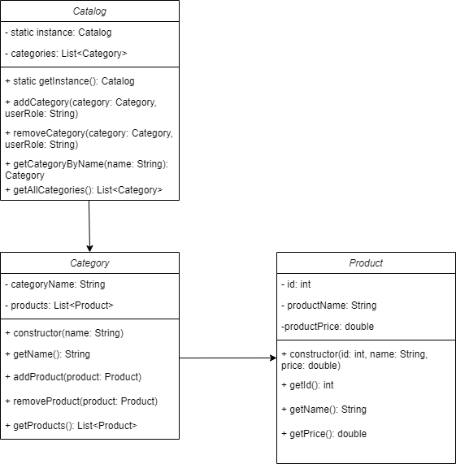

# E-commerce app - Osnaga Robert Viorel

## Introduction

Currently, e-commerce applications have become essential for businesses as well as for consumers. These applications are online platforms that allow sellers to showcase their products to consumers in a way that can be viewed with a click, from any device.

The utility of e-commerce applications:
- **Accessibility** - The application is available 24/7, allowing buyers to view and purchase products at any time.
- **Extended market** - This application has no coverage limits; it can be accessed from anywhere, so products have a global reach.
- **Cost efficiency** - An e-commerce application is cheaper to maintain than a physical store.

The aim is to develop an e-commerce **web application** through which a seller can easily showcase their products, observe statistics on sales and products, and where the buyer has an easy-to-use interface to find the desired product.

## Technologies used:

- **Front-end** - Angular 18.0.1 + TypeScript 5.4.0 and Node.js 20.15.1 - **port**: 4200 (for Angular)
- **Back-end** - Java 19 + Spring Boot 3.3.1 - **port** - 443 (for HTTPS)
- **Database** - MySQL 8.0.34 - **port** - 3306
- **OS** - Windows 10

**Angular** is the ideal front-end framework for developing modern web applications that businesses seek. It meets key characteristics such as automation, high performance, flexibility, scalability, and rapid development, making it well-suited for contemporary web application needs.

**Spring Boot** simplifies the development of production-ready applications by providing a set of conventions and default configurations. It offers comprehensive support for RESTful APIs, security, data access, and more, making it an ideal choice for modern backend development.

**MySQL** is a reliable and widely-adopted relational database management system known for its performance, scalability, and ease of use.

### Setup

#### Front-End Setup

**Step 1** - Download and install [Node.js](https://nodejs.org/en) version 20.15.1 from the official website.
**Step 2**: Install Angular CLI - open the PowerShell and run the following command:

    npm install -g @angular/cli@18.0.1

#### Back-end Setup

**Step 1**: Install Java - Download  [Java 19](https://www.oracle.com/java/technologies/javase/jdk19-archive-downloads.html)

**Step 2**: Set Up Spring Boot Project - Use **Spring Initializr** to create a new Spring Boot project with the necessary dependencies.

#### Database Setup

**Step 1**: Install MySQL - Download [MySQL 8.0.34](https://dev.mysql.com/downloads/mysql/)

## Application functionalities

When the viewer first enter the site, he will be able to view the products already added without having permission to buy or become a seller. For these features, we need to create an account. There will be two types: a buyer's account that can be created immediately and a seller's account which, after completing the mandatory fields,they will have to wait for an acceptance or rejection response because the entered data needs to be verified.

So, there will be four actors:

- **Visitor** - the actor who can only view the products
- **Buyer** - the actor who can view and purchase products
- **Seller** - the actor who lists their products for sale
- **Admin** - the actor who manages issues

Visitor:

- **Viewing products**: The visitor can explore and see details about various products available on the site.
- **Searching for specific products**: The user can use the search bar to find specific products by name.
- **Selecting a list of products by category**: The visitor can navigate through different categories to find the desired products.
- **Applying filters to a category**: The user can filter products in categories by criteria such as price, brand, rating, etc.
- **Requesting help from an administrator**: The visitor can request assistance or additional information from a site administrator.
- **Creating an account or registering**: The visitor has the option to create an account to benefit from additional functionalities.
- **Viewing reviews**: The visitor can read reviews and ratings from other users to learn more about products of interest.
- **Access to offers and promotions**: Visitors can see current offers and promotions available on the site.

Buyer (in addition to visitor functionalities):

- **Adding products to the cart**: The buyer can add products to the shopping cart for later purchase.
- **Completing orders**: The user can complete the purchasing process by placing an order.
- **Online payment**: The buyer can make payments for ordered products using various online payment methods.
- **Order tracking**: The user can check the delivery status for placed orders.
- **Viewing order history**: The buyer can see a list of all previous orders.
- **Writing reviews**: The user can write and publish reviews for purchased products.
- **Email notifications**: The buyer can receive notifications and updates via email about their orders and other relevant activities.
- **Saving products to the wish list**: The visitor can save preferred products to a wish list for review or purchase later.

Seller:

- **Inventory management**: The seller can monitor and update available stock.
- **Adding a product**: The seller can add new products to the eCommerce platform.
- **Modifying product characteristics**: The seller can edit the details and specifications of existing products.
- **Applying discounts**: The seller can set discounts and promotions for certain products.
- **Sales analysis**: The seller can access reports and statistics about sales performance.
- **Managing orders and deliveries**: The seller can track and manage received orders and delivery processes.
- **Accessing technical support**: The seller can request technical help for issues encountered on the platform.
- **Managing feedback**: The seller can view and respond to reviews and feedback left by customers.

Administrator:

- **Resolving issues reported by buyers, sellers, and visitors**: The administrator manages and solves any problems reported by site users.
- **Verifying registration requests for buyer accounts**: The administrator validates and approves registration requests from new buyers.
- **Monitoring performance**: The administrator oversees the performance of the site and its users.
- **Adding functionalities**: The administrator can implement new features and improvements on the platform.
- **Managing site content**: The administrator can edit and update content on product pages, informational pages, and other sections of the site.
- **Site security**: The administrator ensures the site is protected against security threats and manages user permissions.

### HTTPS implementation

- **Step 1**: Create Self-Signed Certificate
  - keytool -genkey -alias <alias> -storetype <storetype> -keyalg <keyalg> -keysize <keysize> -keystore <keystore> -validity <validity>
- **Step 2**: Updating Application properties

### SMTP implementation

- **Step 1**: Adding the spring-boot-starter-mail dependency
- **Step 2**: Setting up Application Properties for Gmail SMTP Server
- **Step 3**: Creating EmailDetails Class
- **Step 4**: Creating EmailService Interface and EmailServiceImpl Class

## User stories

### USER STORY #1 - Searching for products

**As** a visitor or buyer

**I want to** search for a specific product by name

**So that** I can find the desired product.

**Acceptance criteria:**

**AC#1**

**Scenario**: Finding desired products

**Given** the user is on the main page,

**When** they type the product name in the search bar and press enter,

**Then** the found products are displayed.

**AC#2**

**Scenario**: The desired product does not exist

**Given** the user is on the main page,

**When** they type the product name in the search bar and press enter,

**Then** an empty page with an appropriate message is displayed.

### USER STORY #2 - Selecting a product category

**As a** visitor or buyer

**I want to** search for a specific product by category

**So that** I can find products from the desired category.

**Acceptance criteria:**

**AC#1**

**Sceanrio**: Selecting the desired category

**Given** the user is on the main page,

**When** they look at the left side of the main page,

**Then** they see a column with all available categories from which they can choose.

### USER STORY #3 - Registering as a buyer

**As a** visitor

**I want to** create an account

**So that** I can buy products.

**Acceptance criteria:**

**AC#1** 

**Scenario**: Accessing the registration page

**Given** the user is on the login page,

**When** they click on the Register button,

**Then** they are taken to the registration page.

**AC#2** 

**Scenario**:Registration form

**Given** the user is on the registration page,

**When** they fill in the form with the required data,

**Then** they can submit the form to create an account.

| **Field Name** | **Field Type** | **Mandatory/Optional** |
| -------------- | -------------- | ---------------------- |
| Name           | Free text   Min 6 characters   Max 20 characters | Mandatory |
| First Name     | Free text   Min 6 characters   Max 20 characters | Mandatory |
| Email          | Free text   Min 6 characters   Max 20 characters | Mandatory |  
| Password       | Free text   Min 6 characters   Max 20 characters   The password will require to be as next regex   ^(?=.*[A-Z])(?=.*\d)(?=.*[^\w\s]).{6,}$ | Mandatory |
| Repeat Password|  Free text   Min 6 characters   Max 20 characters   The password will require to be as next regex   ^(?=.*[A-Z])(?=.*\d)(?=.*[^\w\s]).{6,}$ | Mandatory |

**Errors that may occur**

**Error 1**

**Scenario**: Incorrect email format

**Given** the user is filling the registration form,

**When** they enter an incorrect email format,

**Then** an error message is displayed indicating the correct format (firstname@example.com).

**Error 2**

**Scenario**: Not meeting minimum or maximum values

**Given** the user is filling the registration form,

**When** they enter values not meeting the minimum (6 characters) or maximum (20 characters),

**Then** an error message is displayed.

**Error 3**

**Scenario**: Password and Repeat Password contain different passwords

**Given** the user is filling the registration form,

**When** the passwords in the Password and Repeat Password fields do not match,

**Then** an error message is displayed.

**Error 4**

**Scenario**: Email already used

**Given** the user is filling the registration form,

**When** the entered email is already in use,

**Then** an error message is displayed indicating the email is already associated with an account.

### USER STORY #4 - Adding products to the cart

As a **buyer**

**I want to** add desired products

**To** the shopping cart.

**Acceptance criteria:**

**AC#1**

**Scenario**: Adding a product to the cart

**Given** the buyer is on the product page,

**When** they click the Add to cart button,

**Then** the product is added to their shopping cart.

### USER STORY #5 - Writing a review

**As** a buyer

**I want to** write a review

**So that** I can share my experience about a purchased product.

**Acceptance criteria:**

**AC#1**

**Scenario**: Writing a review

**Given** the buyer is on the product page of a purchased product,

**When** they give a rating and complete a description,

**Then** they can submit their review.

**Errors that may occur**

**Error 1**

**Scneario**: Incorrect product page

**Given** the buyer is on the product page,

**When** they access a product they did not purchase,

**Then** they do not have access to write a review.

### USER STORY #6 - Registering as a seller

**As a** visitor

**I want to** create an account

**So that** I can sell my products.

**Acceptance criteria:**

**AC#1** 

**Scneario**: Completing data

**Given** the visitor is on the registration page,

**When** they complete the necessary data,

**Then** they will receive an email with the account acceptance or rejection.

### USER STORY #7 - Adding products

**As a** seller

**I want to** add one or more products

**So that** they are available for sale.

**AC#1**

**Given** the seller is on the add product page,

**When** they complete the product details,

**Then** they can submit the form to add the product.

| **Field Name**  | **Field Type** |
| --------------- | -------------- |
| Product Name    | Free text |
| Product Category| Free text |
| Description     | Free text |
| Specifications  | Free text |

**AC#2**

**Given** the seller is on the add product page,

**When** they upload a CSV file with product details,

**Then** multiple products are added to their inventory.

### USER STORY #8 - Applying discounts

**As a** seller

**I want to** add a discount to one or more products

**So that** I can offer promotions.

**Acceptance criteria**

**AC#1** 

**Scenario**: Selecting products

**Given** the seller is on the discount page,

**When** they select products from their list and enter the discount percentage,

**Then** the discount is applied to the selected products.

### USER STORY #9 - Approving accounts

**As an** administrator

**I want to** approve some requests from sellers

**So that** they can sell on the platform.

**Acceptance criteria**

**AC#1** 

**Scenario**: Verifying accounts

**Given** the administrator is on the newly registered accounts page,

**When** they verify the account details,

**Then** they can approve or deny the account.

**AC#2** 

**Scenario**: Denial reasons

**Given** the administrator is verifying an account,

**When** they decide to reject the account,

**Then** they can add reasons for the rejection.

**AC#3** 

**Scenario** - Approving accounts

**Given** the administrator is verifying an account,

**When** the account details are correct,

**Then** they can approve the account by clicking the approve button.

## Communication Protocol

### For client-server connection, the application will use **HTTPS**

### For sending emails, the application will use **SMTP**

## Message Flow

### Visitor accesses the web page

**GET** request that returns the main page 

**/e-commerce.html**

**Expected Response**: HTTP 200 OK with the main page content

### Viewing a product

**The visitor** selects a product, a

**GET /product/{product_id}** request is sent, and **the visitor**

receives the product page.

**Expected Response**: HTTP 200 OK with the product page content

### Log in

**The user** enters their email and password,

**the browser** sends a request of type 

**POST /api/auth/login**,

**Request Body**: 

    {
    "username": "user@example.com", 
    "password": "password123"
    }

**Headers**: Content-Type: application/json

**Expected Response**: HTTP 200 OK with authentification token

### Adding a product to the cart

**The buyer** adds a product to the cart,

**the browser** sends a request of type

**POST /cart/add** 

**Request Body**: 

    {
    "productId": "{productID}", 
    "quantity": 1
    }

**Headers**: Content-Type: application/json

**Expected Response**: HTTP 200 OK with updated cart details

### Completing an order

**The buyer** completes the checkout process,

**the browser** sends a request of type

**POST /order/checkout**

**Request Body**:

    {
    "userId": "67890", 
    "cart": [...], 
    "paymentMethod": "creditCard", 
    "shippingAddress": {...}
    }

**Headers**: Content-Type: application/json

**Expected Response**: HTTP 200 OK with order confirmation details

### Writing and submitting a review

**The visitor** writes a review for a purchased product,

**the browser** sends a request of type

**POST /review/submit**

**Reqeust Body**:

    {
    "productId": "12345",
    "userId": "67890",
    "rating": 5,
    "comment": "Good!" 
    }

**Headers**: Content-Type: application/json

**Expected Response**: HTTP 200 OK with confirmation of review submission

### Adding a product by the seller

**The seller** goes to the add product page,

fills in the **details**, and **the browser** sends

a request of type **POST /api/addProduct**

**Request Body**:

    {
    "sellerId": "67890",
    "productName": "New product",
    "description": "Description about the product",
    "price": 100.0,
    "category": "Electronics",
    "stock": 1500
    }

**Headers**: Content-Type: application/json

**Expected Response**: HTTP 200 OK with confirmation of product addition

### Applying discounts

**The seller** goes to the discounts page, selects

**the products** to which a **discount** is applied, and

**the browser** sends a request of type

**POST /discount/apply**

**Request Body**:

    {
    "productIds": [1,2,3,4],
    "sellerId": "67890",
    "discountPercentage": 20,
    "duration": 7
    }

**Headers**: Content-Type: application/json

**Expected Response**: HTTP 200 OK with confirmation of discount application

### Approving accounts

**The administrator** goes to the pending accounts page,

checks the details submitted by the seller, and approves or rejects the request,

**the browser** sends a request of type

**POST /account/approve**

**Request Body**:

    {
    "accountId": "12345",
    "approvalStatus": true
    }

or

    {
    "accountId": "12345",
    "approvalStatus": false
    }

**Headers**: Content-Type: application/json

Expected Response: HTTP 200 OK with confirmation of account approval or rejection

## Scalability and Securiy Considerations

### Machine specifications

**CPU** : 4-8 processors

**RAM** : 16-32 GB RAM

**Storage** : 250GB SSD

**Network** : high-speed internet connection, 1 Gbps

### Maximum load

**RPS** - between a minimum of 300 and a maximum of 700

**Simultaneous users** - 5000 simultaneous users

**Number of simultaneous transactions** - minimum 1000, maximum 3000

### Security measures

**HTTPS** - The communications between clients and servers will be encrypted using HTTPS

**Authentification and Authorization**

- **JWT** for secure token-based authentication.
- **OAuth2** for third-party authentication to allow users to register and log in using accounts from Google, Facebook, etc.

**Data Encryption** - Encrypt sensitive data

**Input Validation and Sanitization** - Validate and sanitize all user inputs to prevent SQL injection.

**Access Control** - Spring Security in the backend to define roles and permissions

## Use case diagram

## Databse design

## Application Diagram

## UML Diagrams

### Create Catalog

### Notifying subscribed buyers

### Create Account

## Prototype

### Main page

Main page of the buyer and visitor accounts, where you can see the categories that the website are sellings and some of the best sellers

- Search bar - you can type for a product
- SHOP4ALL - press to come back to main page
- Category buttons - press to go to a category of products
- the favorites button, leads you to the favorites page if you are logged in, otherwise it opens the log in page
- cart button - press to go a the cart page if you are logged in, otherwise it opens the log in page
- account button - press to see information about the account if you are looged in, otherwise it opnes the log in page
- Image, Product Name, Price - type on one of those to open a product's page

### Product page

The product page contains the images of the product, the price and the description about his functionalities. Reviews are written by the persons who bought this item

- Search bar - you can type for a product
- SHOP4ALL - press to come back to main page
- the favorites button, leads you to the favorites page if you are logged in, otherwise it opens the log in page
- cart button - press to go a the cart page if you are logged in, otherwise it opens the log in page
- account button - press to see information about the account if you are looged in, otherwise it opens the log in page
- description button - press to view the product's description
- review button - press to view reviews from buyers
- add to cart button - press to add the product to cart if you are logged in, otherwise it opens the log in page

### Cart

The cart is the page where all the products that a buyer added to cart can see and place the order

- Search bar - you can type for a product
- SHOP4ALL - press to come back to main page
- the favorites button, leads you to the favorites page if you are logged in, otherwise it opens the log in page
- cart button - press to go a the cart page if you are logged in, otherwise it opens the log in page
- account button - press to see information about the account if you are looged in, otherwise it opens the log in page
- Quantity button - show your quantity and ce be modified
- Delete from cart - Delte the product from the cart
- Image button - Press to go to the product's page
- Place the order button - used to go to the order details

### Order details

Order details page consists of filling in some billing and deliveery data

- Search bar - you can type for a product
- SHOP4ALL - press to come back to main page
- the favorites button, leads you to the favorites page if you are logged in, otherwise it opens the log in page
- cart button - press to go a the cart page if you are logged in, otherwise it opens the log in page
- account button - press to see information about the account if you are looged in, otherwise it opens the log in page
- Select county - select a county from a list
- Type your city - The city where your order should come
- Type street - The street where your order should come
- Type address - The address your order should come
- Type phone - The phone number for the delivery team
- Comple the order button - Button to finish the order

### Log in

The log in page where the user need to complete the email address and password to be a buyer ir a seller based on his type of account

- Search bar - you can type for a product
- SHOP4ALL - press to come back to main page
- the favorites button, leads you to the favorites page if you are logged in, otherwise it opens the log in page
- cart button - press to go a the cart page if you are logged in, otherwise it opens the log in page
- account button - press to see information about the account if you are looged in, otherwise it opens the log in page
- Type your email - The email used to register on the website
- Type your password - The password used to register on the website
- Connect button - used to connect to the account, if it correct it will goo to the main page, if not an error message will appear

### Register buyers

A page where the viewer need to complete some datas to be a buyer

- Search bar - you can type for a product
- SHOP4ALL - press to come back to main page
- the favorites button, leads you to the favorites page if you are logged in, otherwise it opens the log in page
- cart button - press to go a the cart page if you are logged in, otherwise it opens the log in page
- account button - press to see information about the account if you are looged in, otherwise it opens the log in page
- Type your First Name - client's first name
- Type your Last Name - client's last name
- Type your email - client's email to log in to the website and receive mails
- Type your password - client's password to log in to the website
- Type your password - as above, the two passwords must be identical
- Create account button - button to confirm your data, if everything is alright the client is redirected to the main page, otherwise something is wrong and an error message will appear

### Register seller

A page where the viewer need to complete some datas to be a seller. Also the seller nee to wait some time to be accepted.

- Search bar - you can type for a product
- SHOP4ALL - press to come back to main page
- the favorites button, leads you to the favorites page if you are logged in, otherwise it opens the log in page
- cart button - press to go a the cart page if you are logged in, otherwise it opens the log in page
- account button - press to see information about the account if you are looged in, otherwise it opens the log in page
- Type your first name - seller's first name
- Type your last name - seller's last name
- Type Comapany Name - seller's company name
- Type your email - seller's email to log in
- Type your email - seller's email to log in to the website and receive mails
- Type your password - seller's password to log in to the website
- Type your password - as above, the two passwords must be identical
- Type a short description about the products - the seller must give us some examples of the products to see if they fit the requirements of our site
- Create account button - button to confirm your data, if everything is alright the seller is redirected to the main page, otherwise something is wrong and an error message will appear

### Dashboard

The main page of the seller, where he can see some statistics
about his total sales and sales on a week and total customers of all time and of a week.

Also, he can see the monthly sales on a chart and best selling products

- SHOP4ALL - button to go back to dashboard
- Add product button - go to add product page
- Reports button - go to reports page
- Discounts button - go to discounts page
- Reviews button - go to reviews page
- Products button - go to products page
- Log out - log out from the seller account

### Add product

Add products page where the seller can add a new product based on the left panel from the left or he can add multiple products using a csv file based on the information from the right panel.

- SHOP4ALL - button to go back to dashboard
- Add product button - go to add product page
- Reports button - go to reports page
- Discounts button - go to discounts page
- Reviews button - go to reviews page
- Products button - go to products page
- Log out - log out from the seller account
- Type your product name - the new product's name
- Select category - select a category in which the product falls
- Select subcategory - select a subcategory in which the product falls
- Add Price - price for the product
- Add Stock - the number of products you can sell
- Add a description about your product - The description that will see the buyers
- Add products button - add the product
- Upload csv file - a button to upload a csv file based on the information bellow
- Add products button - add the products from the csv file

### Reports

The chart page displays information about products and customers to the seller in order to better manage the customers and products they want to continue with.

- SHOP4ALL - button to go back to dashboard
- Add product button - go to add product page
- Reports button - go to reports page
- Discounts button - go to discounts page
- Reviews button - go to reviews page
- Products button - go to products page
- Log out - log out from the seller account
- Per week buttons - We can choose for the charts to be per days, weeks, months or years

### Orders

The order page contains all the orders made by clients at a specific seller. The seller need to confirm that the order is on delivery, he also can speak with the client and drop the order if something happened.

- SHOP4ALL - button to go back to dashboard
- Add product button - go to add product page
- Reports button - go to reports page
- Discounts button - go to discounts page
- Reviews button - go to reviews page
- Products button - go to products page
- Log out - log out from the seller account
- Confirm the order button - a button that will send an email to the buyer about the delivery of the command
- Speak with the client button - seller can speak with the buyer about informations about his order details
- Drop the order button - seller can reject orders

### Discounts

The purpose of the discount page is to add a new offer of a product or an entire category. The seller can also extend the campaign or remove it.

- SHOP4ALL - button to go back to dashboard
- Add product button - go to add product page
- Reports button - go to reports page
- Discounts button - go to discounts page
- Reviews button - go to reviews page
- Products button - go to products page
- Log out - log out from the seller account
- < Select from here > - choose a product or a category
- ___ % - complete with the discount percentage
- From ____ To ____ - complete the start and the finish of the discount
- Add to list - button to add the discount to the right panel
- Apply discounts - button to confirm the discounts
- Extend the offer - button to extend the discount of a product/category
- Delete discount - finish the discount time earlier

### Reviews

The purpose of the review page is to display feedback from customers, how satisfied they are with the product. The seller can respond to these reviews or can remove this review notice from his page

- SHOP4ALL - button to go back to dashboard
- Add product button - go to add product page
- Reports button - go to reports page
- Discounts button - go to discounts page
- Reviews button - go to reviews page
- Products button - go to products page
- Log out - log out from the seller account
- Comment button - seller can speak with the buyer
- mark as seen button - seller can delete the message from the review page

### Products

The product page shows the seller all the products he has for sale as well as the description, price and stock. He can modify all the mentioned or remove the product if it is no longer in stock or it no longer makes sense to continue with it.

- SHOP4ALL - button to go back to dashboard
- Add product button - go to add product page
- Reports button - go to reports page
- Discounts button - go to discounts page
- Reviews button - go to reviews page
- Products button - go to products page
- Log out - log out from the seller account
- Add stock button - the seller can introduce more stock to a products
- Change characteristics - the seller can change the name, the description of the product or the price
- Delete the products - the seller can delete the product